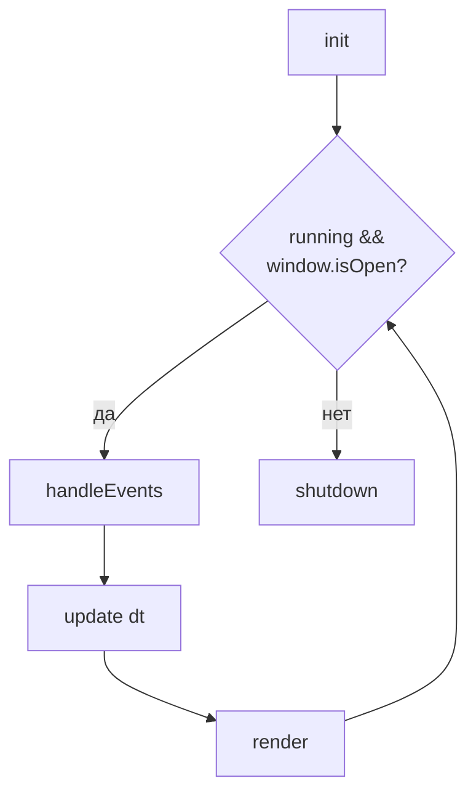
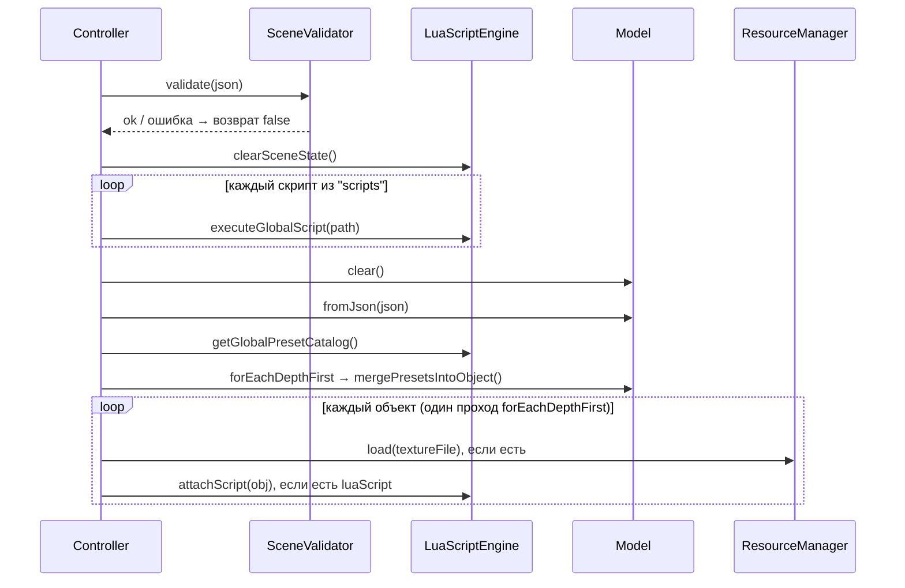
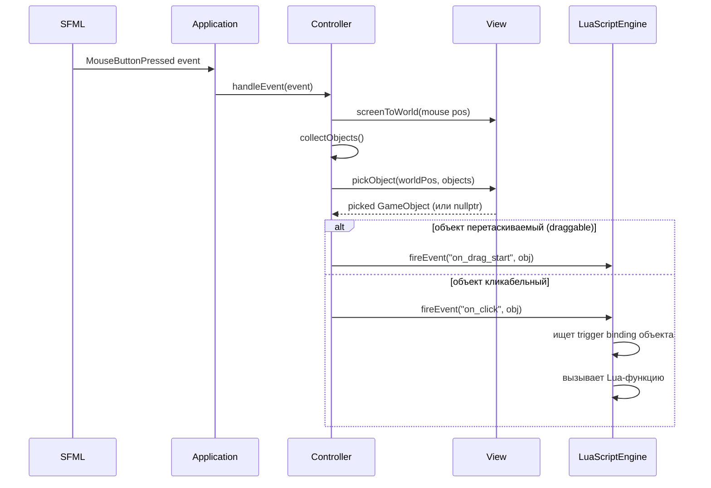

# Архитектура DICE

## 1. Обзор модулей

DICE следует паттерну MVC, расширенному слоями скриптинга и управления ресурсами.

**Иерархия объектов:** классическое C++ наследование — `Card`, `Chip`, `Dice`, `Tile`, `Deck` наследуются от `GameObject`, который наследует `sf::Drawable` и `sf::Transformable`. Дочерние объекты хранятся в `vector<shared_ptr<GameObject>>` (shared ownership); обратная ссылка на родителя — сырой non-owning указатель `GameObject*`. `Model` содержит плоский `unordered_map<string, shared_ptr<GameObject>>` для поиска по id за O(1) и список корней. ECS и непрерывных массивов нет — объекты размещаются в куче через `shared_ptr`.

**Жизненный цикл объектов:** `shared_ptr` одновременно хранится в `children` родителя и в плоской карте `Model::objects_`. Для полного уничтожения объекта используй `Model::removeObject(id)` — он удаляет ссылку из обоих мест. Прямой вызов `parent->removeChild(id)` оставит объект живым в карте модели.

**Состояние:** Игровое состояние хранится полностью в Lua-глобалах (например, таблица `game` в dice_demo). `ActionManager` реализован в `dice::core` и поддерживает `saveSnapshot`/`undo`/`redo` через JSON-снепшоты модели, но не подключён к игровому циклу и недоступен из Lua — откат состояния пока реализуется вручную в скрипте.

| Модуль | Ответственность | Namespace |
|--------|----------------|-----------|
| `Application` | Главный цикл, связывает все подсистемы | `dice` |
| `ConfigLoader` | Читает `game.json` в типизированный конфиг | `dice` |
| `Model` | Дерево объектов сцены (корни + плоский id-map) | `dice::core` |
| `Controller` | Ввод, Lua-мост, переходы между сценами | `dice::controller` |
| `View` | Рендеринг SFML, координатное преобразование, pick объектов | `dice::view` |
| `LuaScriptEngine` | Lua VM, реестр функций, диспетчер событий | `dice::scripting` |
| `LuaScript` | Привязка скрипта к конкретному объекту | `dice::scripting` |
| `SceneValidator` | Валидирует JSON сцены до загрузки | `dice::core` |
| `ResourceManager` | Типизированный кэш ресурсов (текстуры, шрифты) | `dice::core` |
| `GameObject` | Базовый узел: позиция, текстура, дети, триггеры | `dice::core` |
| `Card` / `Chip` | Специализированные подтипы `GameObject` | `dice::components` |
| `Dice` | Кубик: количество граней, текущее значение, текстуры граней, `roll()` | `dice::components` |
| `Tile` | Клетка сетки: координаты col/row, occupant, фильтр принимаемых типов | `dice::components` |
| `Deck` | Колода: `faceDown`, управляет Card-дочерьми | `dice::components` |
| `Action` / `ActionManager` | Снепшоты модели, undo/redo *(реализовано в core, не подключено к приложению)* | `dice::core` |

---

## 2. Сборка и зависимости

- **Система сборки:** CMake
- **Зависимости** загружаются автоматически через `FetchContent` при первом `cmake ..`:
  SFML, sol2, spdlog, nlohmann/json, Dear ImGui, GoogleTest.
  Lua 5.3 устанавливается системным пакетным менеджером (`apt install liblua5.3-dev`).
- Внешние пакетные менеджеры (vcpkg, Conan) не нужны

Инструкции по сборке см. в [README.md](../README.md#установка-на-linux).

---

## 3. Game Loop

| Фаза | Что происходит |
|------|---------------|
| **init** | Читает `game.json`, создаёт окно, загружает шрифты, настраивает Lua VM, загружает пресеты, загружает стартовую сцену |
| **handleEvents** | Опрашивает SFML-события, маршрутизирует мышь/клавиатуру в `Controller`, UI-события в `View` |
| **update** | Если есть отложенный переход сцены — выполняет его и пропускает остаток фазы; иначе вызывает `lua_global("update", dt)` и обновляет `View` |
| **render** | Очищает буфер, собирает объекты из `Model`, вызывает `view_.render()`, вызывает `lua_global("draw")`, отображает кадр |

---

## 4. Флоу загрузки сцены

**Ключевые детали:**
- Скрипты из секции `"scripts"` загружаются **до** `Model::fromJson` — они регистрируют триггеры до создания объектов. Если любой из скриптов завершается с ошибкой, загрузка сцены прерывается.
- Пресеты из `assets/presets.json` мержатся в `triggerBindings` объекта после загрузки модели — явные `triggers` в JSON имеют приоритет над пресетами.
- Если `SceneValidator` возвращает ошибку, загрузка прерывается; состояние модели не меняется.
- `clearSceneState()` сбрасывает **все** подписки текущей сцены: `scriptRegistry_`, `inlineCallbacks_`, `triggerCatalog_`, `keyHandlers_` и `moduleCache_`. Обработчики `engine.onKey`, зарегистрированные в предыдущей сцене, **не сохраняются** при переходе на новую.
- Если в JSON объекта указан несуществующий пресет, движок выводит `spdlog::warn` и пропускает его — загрузка сцены не прерывается.

---

## 5. Обработка пользовательского действия: клик → Lua

**Важно:** Для **не-draggable** объектов `on_click` срабатывает при **нажатии** (`MouseButtonPressed`). Для **draggable** объектов `on_click` срабатывает при **отпускании** (`MouseButtonReleased`), только если не было перетаскивания (`wasDragging_ == false`).

---

## 6. Lua API Reference

### C++ функции, доступные из Lua

| Функция | Сигнатура | Сложность | Описание |
|---------|-----------|-----------|----------|
| `cpp_rand` | `(lo: int, hi: int) → int` | O(1) | Случайное целое в \[lo, hi\] |
| `cpp_shuffle_children` | `(id: string)` | O(N) прямых детей | Перемешать детей объекта по id |
| `cpp_shuffle` | `(t: table)` | O(N) | Перемешать Lua-таблицу in-place |
| `cpp_draw_text_left` | `(s, x, y, size, r, g, b)` | O(1) | Текст с выравниванием по левому краю |
| `cpp_draw_text_center` | `(s, x, y, size, r, g, b)` | O(1) | Текст по центру |
| `cpp_draw_text_right` | `(s, x, y, size, r, g, b)` | O(1) | Текст с выравниванием по правому краю |
| `cpp_draw_rect` | `(x, y, w, h, r, g, b, a)` | O(1) | Закрашенный прямоугольник |
| `cpp_set_obj_color` | `(id, r, g, b, a)` | O(1) avg | Задать цвет объекту по id |
| `cpp_set_obj_texture` | `(id, path)` | O(1) avg | Сменить текстуру объекту по id |
| `cpp_dice_roll` | `(id: string) → int` | O(1) avg | Бросить кубик: случайное значение в [1, faceCount], применить текстуру грани, вернуть значение |
| `cpp_deck_draw` | `(id: string) → string` | O(1) avg | Снять верхнюю карту с колоды, поднять её до корня сцены, вернуть её id (пусто — если колода пуста) |
| `cpp_deck_count` | `(id: string) → int` | O(1) avg | Количество карт в колоде |
| `cpp_log` | `(msg: string)` | O(1) | Лог через spdlog; поддерживает UI-коллбэк. Используется в примерах |
| `log` | `(msg: string)` | O(1) | Лог через spdlog (только вывод, без коллбэка) |

> `cpp_draw_*` вызываются из `draw()` — они рисуют прямо в текущий кадр и не сохраняют результат между кадрами.

### engine.* функции

| Функция | Сложность | Описание |
|---------|-----------|----------|
| `engine.getObject(id)` | O(1) avg | Поиск по `unordered_map` — безопасно вызывать в `update()` |
| `engine.trigger(name, fn)` | O(1) | Зарегистрировать именованный триггер |
| `engine.on(id, event, fn)` | O(1) | Зарегистрировать inline-обработчик события `event` для объекта с id; `fn(self)` — альтернатива именованным триггерам |
| `engine.onKey(key, fn)` | O(1) | Зарегистрировать обработчик клавиши |
| `engine.intersects(id1, id2)` | O(1) avg | Проверить пересечение AABB двух объектов по id; возвращает `false`, если объект не найден |
| `engine.reloadScene()` | — | Перезагрузить текущую сцену (отложено до следующего кадра) |
| `engine.loadScene(path)` | — | Загрузить другую сцену (отложено до следующего кадра) |

> `engine.getObject` использует `unordered_map` и безопасен в `update()`. `collectObjects()` — отдельная внутренняя функция `Controller`, делающая обход всего дерева сцены — не вызывается из Lua напрямую.

### Методы GameObject (доступны в обработчиках событий через `self`)

| Метод | Описание |
|-------|----------|
| `self:getId()` | Строковый id объекта |
| `self:getName()` / `self:setName(s)` | Имя объекта |
| `self:getType()` | Строка типа (`"GameObject"`, `"Card"`, `"Chip"`, `"Dice"`, `"Tile"`, `"Deck"`) |
| `self:getX()` / `self:getY()` | Позиция объекта |
| `self:setPosition(x, y)` | Задать позицию |
| `self:getZOrder()` / `self:setZOrder(z)` | Порядок слоёв |
| `self:getRotation()` / `self:setRotation(deg)` | Вращение в градусах |
| `self:getScaleX()` / `self:getScaleY()` / `self:setScale(x, y)` | Масштаб |
| `self:isVisible()` / `self:setVisible(bool)` | Видимость |
| `self:isActive()` / `self:setActive(bool)` | Активность (включая дочерние события) |
| `self:isDraggable()` / `self:setDraggable(bool)` | Перетаскиваемость |
| `self:setColor(r, g, b, a)` | Цвет (RGBA, 0–255) |
| `self:getIntProperty(key, default)` | Читать int-свойство из `properties` |
| `self:getFloatProperty(key, default)` | Читать float-свойство |
| `self:getStringProperty(key, default)` | Читать string-свойство |
| `self:getBoolProperty(key, default)` | Читать bool-свойство |
| `self:setIntProperty(key, val)` | Задать int-свойство |
| `self:setStringProperty(key, val)` | Задать string-свойство |
| `self:hasTag(tag)` / `self:getTags()` | Проверить/получить теги объекта |

`engine.getObject(id)` возвращает конкретный тип — если объект является `Card`, `Chip` и т.д., Lua получает именно этот тип и может вызывать его методы.

### Методы подтипов (доступны через `self` или объект из `engine.getObject`)

**Card:** `flip()`, `isFaceUp()`, `setFaceUp(bool)`, `setPlayer(int)`, `getPlayer()`

**Chip:** `getRadius()`, `setRadius(float)`, `getAssetId()`, `setAssetId(string)`, `setPlayer(int)`, `getPlayer()`

**Dice:** `getFaceCount()`, `getValue()` — для броска используй `cpp_dice_roll(id)`

**Tile:** `getCol()`, `getRow()`, `getOccupantId()`, `setOccupant(string)`, `clearOccupant()`, `isOccupied()`, `accepts(string)`

**Deck:** `isFaceDown()`, `count()`, `isEmpty()` — для операций с картами используй `cpp_deck_draw(id)`, `cpp_deck_count(id)`, `cpp_shuffle_children(id)`

### События (имена триггеров)

| Событие | Когда срабатывает |
|---------|-----------------|
| `on_click` | Левая кнопка мыши: для не-draggable — при нажатии; для draggable — при отпускании без перетаскивания |
| `on_hover` | Курсор вошёл в bounds объекта |
| `on_hover_exit` | Курсор вышел из bounds объекта |
| `on_drag_start` | Нажатие ЛКМ на draggable-объект (срабатывает сразу при нажатии, до любого движения) |
| `on_drag_end` | Отпускание ЛКМ с draggable-объекта — срабатывает всегда, в том числе при обычном клике без перемещения |
| `on_move` | Позиция объекта изменилась в процессе drag |

---

## 7. `game.json` Reference

### Поведение при превышении `luaMemoryLimitMb`

Реализовано через кастомный аллокатор `guardedAlloc`. При превышении лимита аллокатор возвращает `nullptr` → Lua поднимает memory error → `sol::protected_function` в `callGlobal` перехватывает его → ошибка логируется через `spdlog::error`. **Движок не падает, сцена не выгружается** — только конкретный вызов скрипта завершается с ошибкой в лог.

| Поле | Тип | По умолчанию | Описание |
|------|-----|-------------|----------|
| `title` | string | `"DICE"` | Заголовок окна |
| `windowWidth` | int | `1280` | Ширина окна в пикселях |
| `windowHeight` | int | `720` | Высота окна в пикселях |
| `framerateLimit` | int | `60` | Лимит FPS |
| `resizable` | bool | `true` | Разрешить изменение размера окна |
| `clearR` / `clearG` / `clearB` | int | `30/30/40` | Цвет фона (0–255) |
| `startScene` | string | `"scenes/demo.json"` | Путь к начальной сцене |
| `globalScript` | string | `""` | Lua-скрипт, выполняемый один раз при старте приложения (после установки лимита памяти Lua) |
| `fonts` | array | `[]` | `[{id, path}]` — список шрифтов |
| `showFPS` | bool | `true` | Оверлей счётчика FPS |
| `showObjectCount` | bool | `true` | Оверлей числа объектов |
| `showControls` | bool | `true` | Оверлей подсказок по управлению |
| `luaMemoryLimitMb` | int | `64` | Лимит памяти Lua VM в МБ |
| `maxSceneObjects` | int | `1000` | Максимум объектов в сцене |

> **Координаты и resizable-окно:** `View` использует `sf::View` с отображением 1:1 (физические пиксели = логические координаты). При `resizable: true` и изменении размера окна `sf::View` перестраивается под новые размеры — координаты в JSON и в вызовах `cpp_draw_*` / `cpp_draw_text_*` жёстко привязаны к пикселям и **не масштабируются автоматически**. Если сцена рассчитана на 1280×720, при другом размере окна абсолютные позиции поплывут. Рекомендуется либо не использовать `resizable: true`, либо вычислять позиции относительно размера окна в скрипте.

---

## 8. Сетевая часть *(в разработке)*

> ⚠️ В разработке — документация будет добавлена позже.

---

## 9. ActionValidator *(в разработке)*

> ⚠️ В разработке — документация будет добавлена позже.
