# Примеры DICE

Здесь собраны примеры для тех, кто создаёт игры с помощью DICE.

## Как запустить любой пример

После сборки (`cmake . -B build && cd build && make`) CMake автоматически копирует `assets/`, `scenes/`, `scripts/` и `game.json` в папку `build/`.

1. Отредактируйте `build/game.json` — укажите нужную сцену в поле `startScene`:
   ```json
   { "startScene": "scenes/snippets/draw-object.json" }
   ```
2. Запустите из папки `build/`:
   ```bash
   ./dice
   ```

> Запускайте бинарник из `build/` — `game.json` и все ресурсы ищутся относительно рабочей директории.

---

## Сниппеты

Изолированные примеры одной конкретной техники. Идеально для копипасты.

### Базовые объекты

| | Сниппет | Описание | Теги |
|--|---------|----------|------|
| 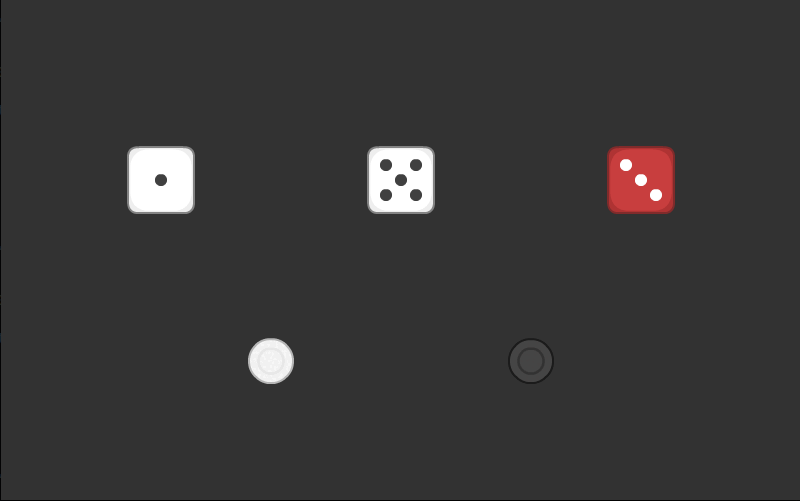 | [Отрисовать объект](snippets/draw-object.md) | Разместить объект с текстурой на сцене | `json` |
| 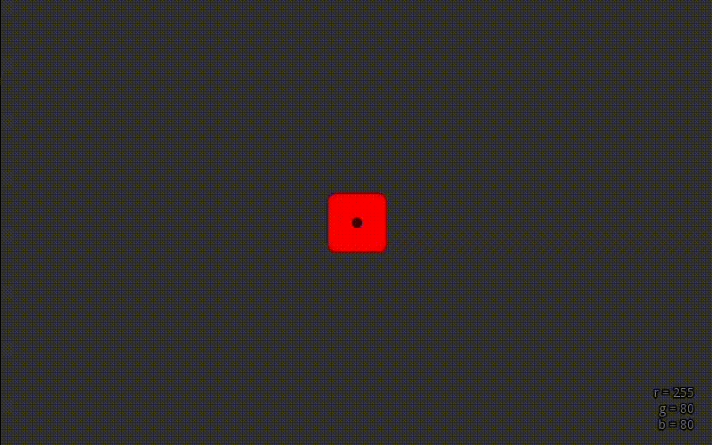 | [Цвет объекта](snippets/object-color.md) | Задать цвет в JSON и сменить из Lua | `json` `lua` |
| 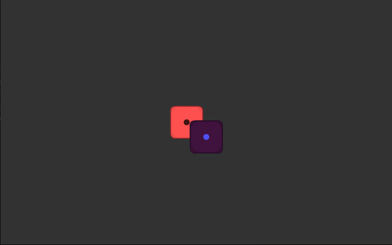 | [Порядок слоёв](snippets/zorder.md) | Управлять zOrder для перекрытия объектов | `json` |
| 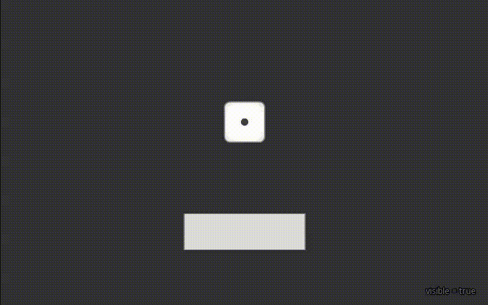 | [Видимость объекта](snippets/object-visibility.md) | Скрыть / показать объект из Lua | `lua` |

### Взаимодействие

| | Сниппет | Описание | Теги |
|--|---------|----------|------|
| 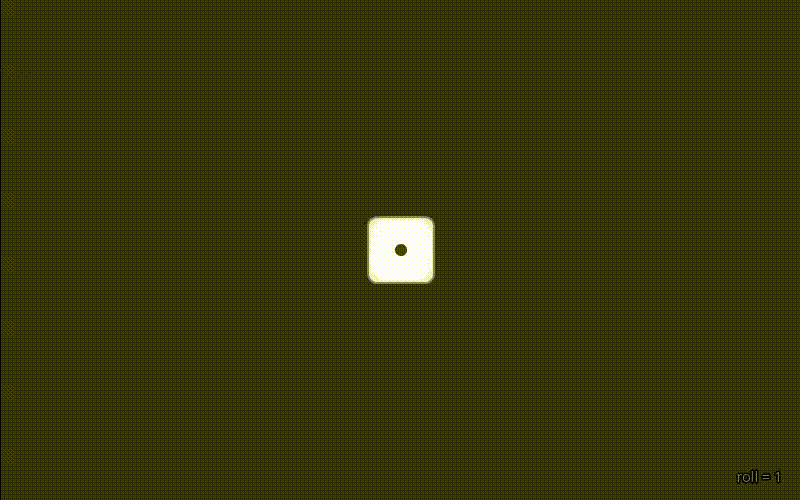 | [Клик по объекту](snippets/on-click.md) | Реакция на нажатие через `triggers` | `triggers` `lua` |
| 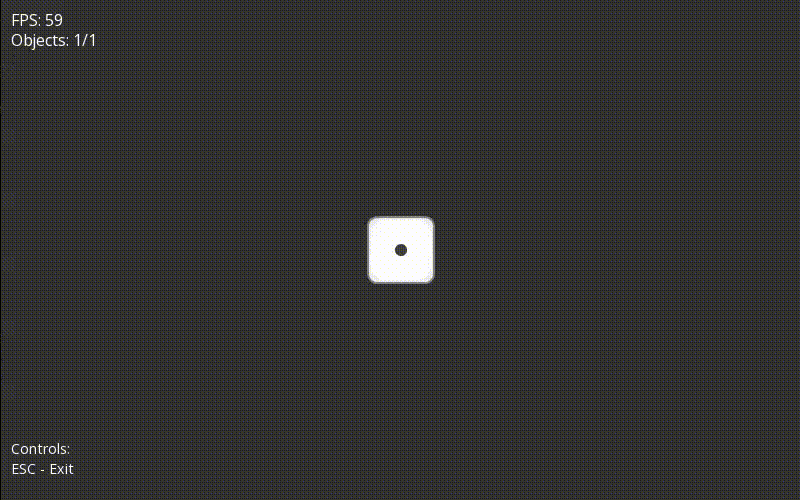 | [Перетаскивание](snippets/drag-object.md) | Объект с `draggable: true` | `json` |
| 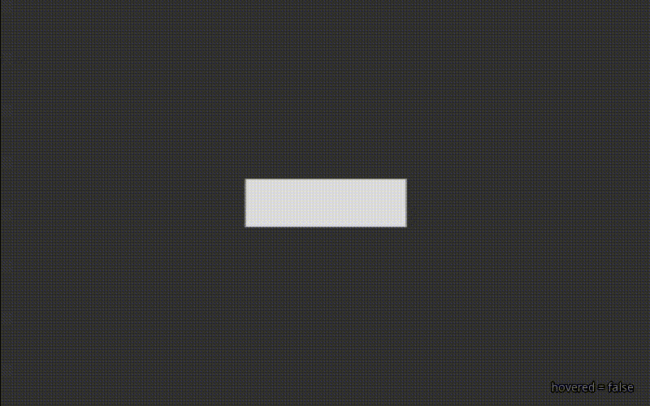 | [Ховер](snippets/on-hover.md) | Подсветка при наведении мыши | `triggers` `lua` |
| 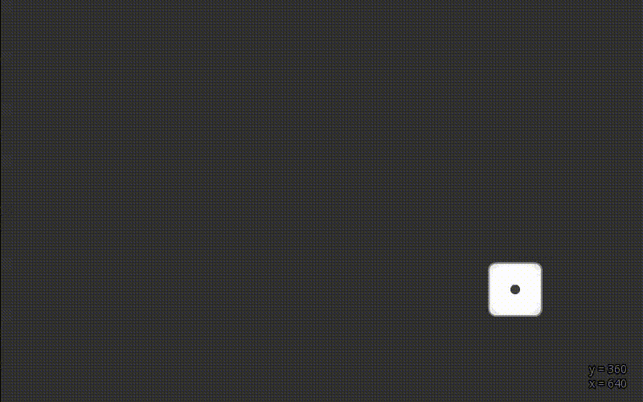 | [Клавиатура](snippets/keyboard-input.md) | Двигать объект стрелками | `lua` `input` |

### Lua-скриптинг

| | Сниппет | Описание | Теги |
|--|---------|----------|------|
| 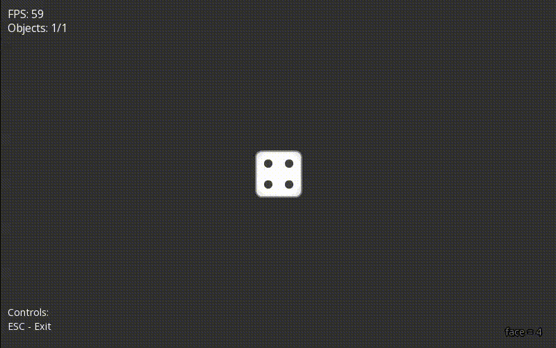 | [Смена текстуры](snippets/change-texture.md) | Менять текстуру объекта из Lua | `lua` `texture` |
| 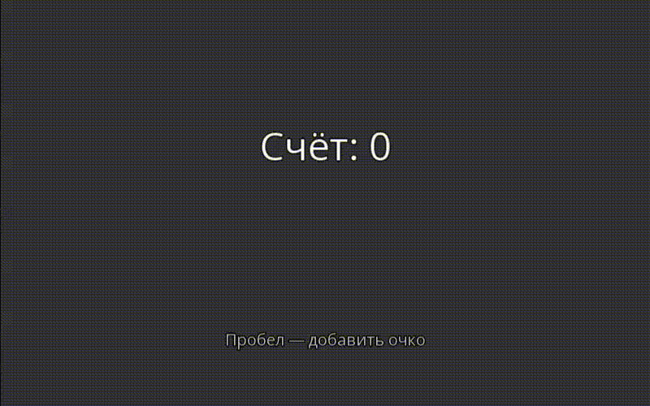 | [Рисовать текст](snippets/draw-text.md) | Вывод текста через `cpp_draw_text_*` | `lua` `ui` |
|  | [Рисовать прямоугольник](snippets/draw-rect.md) | Рисовать фигуры через `cpp_draw_rect` | `lua` `ui` |
| 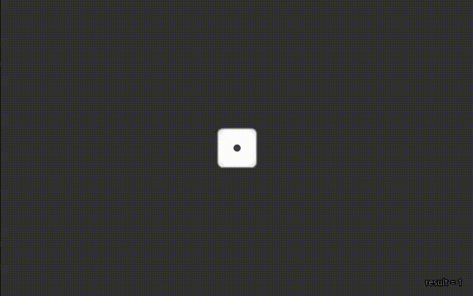 | [Случайные числа](snippets/random.md) | Бросить кубик через `cpp_rand` | `lua` |
| 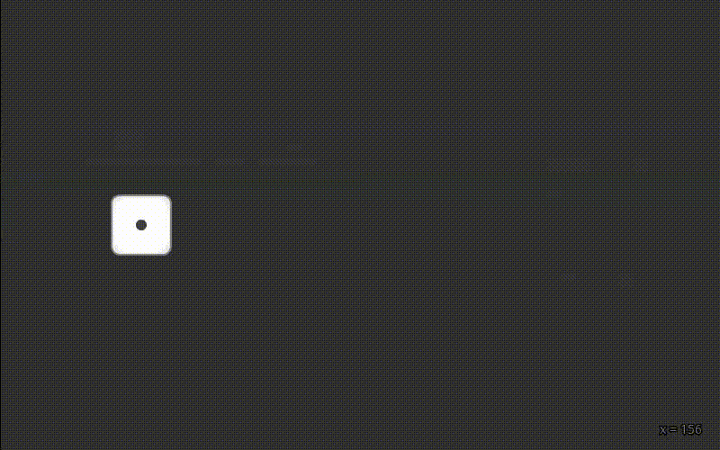 | [Update-цикл](snippets/update-loop.md) | Анимация через `update(dt)` | `lua` `animation` |

### Объекты и данные

| | Сниппет | Описание | Теги |
|--|---------|----------|------|
| 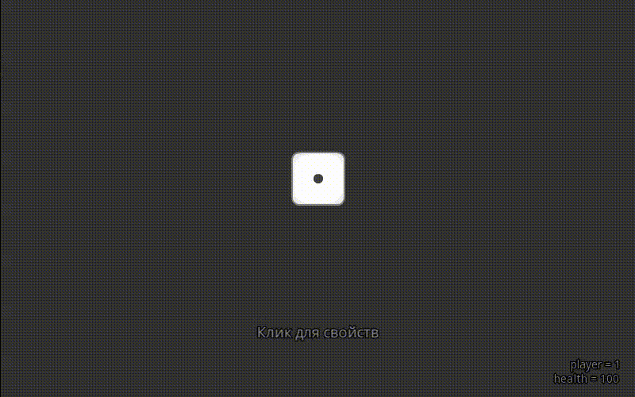 | [Свойства объекта](snippets/object-properties.md) | Кастомные данные через `properties` | `json` `lua` |
|  | [Иерархия объектов](snippets/object-hierarchy.md) | Вложенные объекты через `children` | `json` |
| 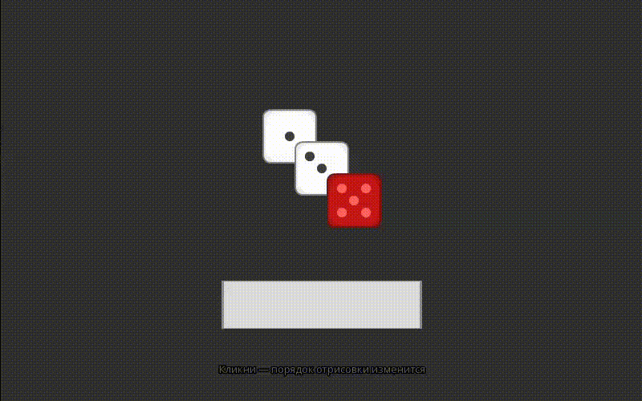 | [Перемешать детей](snippets/shuffle-children.md) | Перемешать порядок дочерних объектов | `lua` |

### Сцены

| | Сниппет | Описание | Теги |
|--|---------|----------|------|
| 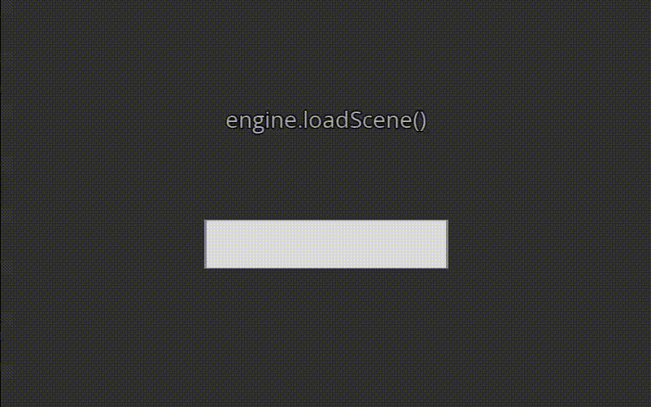 | [Переключение сцен](snippets/scene-switch.md) | Загрузить другую сцену по клику | `lua` `scene` |
| 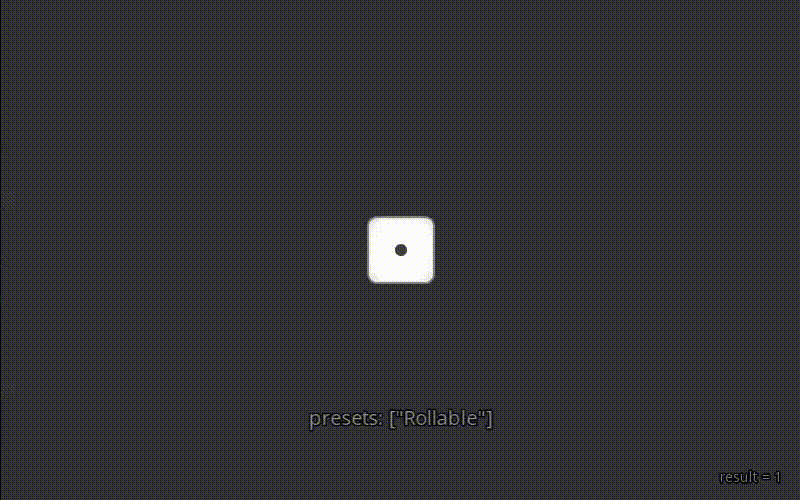 | [Пресеты поведения](snippets/presets.md) | Переиспользовать триггеры через `presets` | `json` `presets` |

---

## Готовые игры

| Игра | Описание | Теги |
|------|----------|------|
| [Игра в кости](games/dice-game.md) | Два игрока бросают кубики, набирая очки до 21 | `triggers` `scripting` `textures` `state` |
| [Нарды](games/nardi.md) | Длинные нарды: перетаскивание шашек, пресеты, Lua-логика хода | `drag` `presets` `hierarchy` `keyboard` |
| [Змейка](games/snake.md) | Аркадная змейка на сетке: уровни сложности, отрисовка через `cpp_draw_rect`, сцена без объектов | `lua` `input` `state` `update` `draw` |
| [Office Escape](games/office-escape.md) | Побег из офисной башни: BSP комнаты-коридоры, карта больше экрана с камерой, гарантированная проходимость | `procgen` `camera` `state` `update` `draw` |
| [Сапёр](games/minesweeper.md) | Классический Сапёр: три сложности, BFS-заливка, ретро-интерфейс Win95 через `draw()`, hitbox-объекты | `Tile` `state` `update` `draw` `bfs` `retro-ui` |
