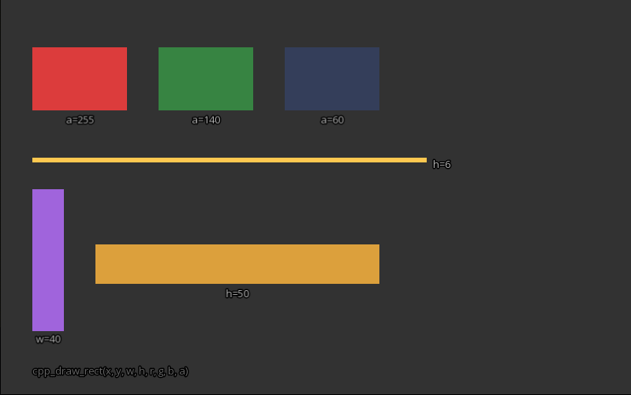

# Рисовать прямоугольник



## Сцена (JSON)

```json
{
  "scripts": ["scripts/snippets/rect_demo.lua"],
  "objects": []
}
```

## Скрипт (Lua) — `scripts/snippets/rect_demo.lua`

```lua
function draw()
    -- Сплошной красный
    cpp_draw_rect(40, 60, 120, 80, 220, 60, 60, 255)
    cpp_draw_text_center("a=255", 100, 152, 13, 180, 180, 180)

    -- Полупрозрачный зелёный
    cpp_draw_rect(200, 60, 120, 80, 60, 200, 80, 140)
    cpp_draw_text_center("a=140", 260, 152, 13, 180, 180, 180)

    -- Почти прозрачный синий
    cpp_draw_rect(360, 60, 120, 80, 60, 100, 220, 60)
    cpp_draw_text_center("a=60", 420, 152, 13, 180, 180, 180)

    -- Широкий тонкий — полоса-разделитель
    cpp_draw_rect(40, 200, 500, 6, 255, 200, 80, 255)
    cpp_draw_text_left("h=6", 548, 200, 13, 180, 180, 180)

    -- Узкий высокий
    cpp_draw_rect(40, 240, 40, 180, 160, 100, 220, 255)
    cpp_draw_text_center("w=40", 60, 430, 13, 180, 180, 180)

    -- Широкий низкий
    cpp_draw_rect(120, 310, 360, 50, 220, 160, 60, 255)
    cpp_draw_text_center("h=50", 300, 372, 13, 180, 180, 180)

    -- Подпись API
    cpp_draw_text_left("cpp_draw_rect(x, y, w, h, r, g, b, a)", 40, 462, 13, 100, 100, 100)
end

function update(dt) end
```

## Что происходит

`cpp_draw_rect(x, y, w, h, r, g, b, a)` рисует залитый прямоугольник. Параметры:

- `x, y` — позиция левого верхнего угла
- `w, h` — ширина и высота
- `r, g, b` — цвет (0–255 каждый)
- `a` — прозрачность: 255 — непрозрачный, 0 — полностью прозрачный

Сцена показывает все три параметра в действии: три прямоугольника одного размера с разным `a`, полоса с малым `h`, узкий и широкий прямоугольники для сравнения `w`/`h`.
