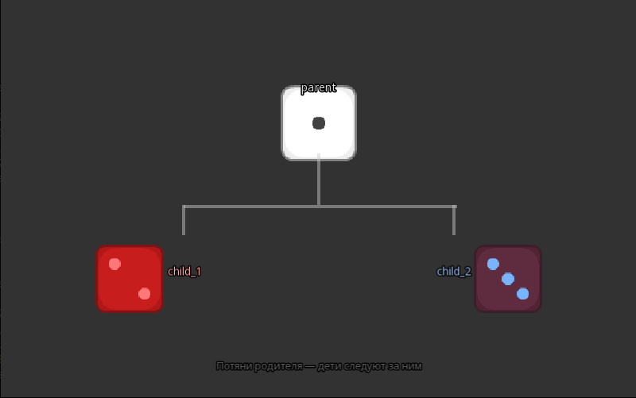

# Иерархия объектов (children)



## Сцена (JSON)

```json
{
  "scripts": ["scripts/snippets/hierarchy_demo.lua"],
  "objects": [
    {
      "type": "GameObject",
      "id": "parent",
      "name": "Родитель",
      "position": [400, 155],
      "scale": [1.4, 1.4],
      "textureFile": "assets/dieWhite_border1.png",
      "zOrder": 0,
      "active": true,
      "visible": true,
      "draggable": true,
      "children": [
        {
          "type": "GameObject",
          "id": "child_1",
          "name": "Дочерний 1",
          "position": [-170, 140],
          "scale": [0.9, 0.9],
          "color": [255, 120, 120, 255],
          "textureFile": "assets/dieRed_border2.png",
          "zOrder": 1,
          "active": true,
          "visible": true,
          "draggable": false
        },
        {
          "type": "GameObject",
          "id": "child_2",
          "name": "Дочерний 2",
          "position": [170, 140],
          "scale": [0.9, 0.9],
          "color": [120, 180, 255, 255],
          "textureFile": "assets/dieRed_border3.png",
          "zOrder": 1,
          "active": true,
          "visible": true,
          "draggable": false
        }
      ]
    }
  ]
}
```

## Скрипт (Lua) — `scripts/snippets/hierarchy_demo.lua`

```lua
function draw()
    -- вертикаль от родителя вниз
    cpp_draw_rect(398, 193, 4, 65, 200, 200, 200, 120)
    -- горизонталь
    cpp_draw_rect(230, 258, 344, 4, 200, 200, 200, 120)
    -- вертикаль к child_1
    cpp_draw_rect(228, 258, 4, 38, 200, 200, 200, 120)
    -- вертикаль к child_2
    cpp_draw_rect(568, 258, 4, 38, 200, 200, 200, 120)

    cpp_draw_text_center("parent",  400, 112, 14, 220, 220, 220)
    cpp_draw_text_center("child_1", 230, 342, 14, 255, 160, 160)
    cpp_draw_text_center("child_2", 570, 342, 14, 160, 200, 255)

    cpp_draw_text_center("Потяни родителя — дети следуют за ним", 400, 462, 13, 100, 100, 100)
end

function update(dt) end
```

## Что происходит

`children` — вложенный массив объектов. Позиции дочерних объектов задаются **относительно родителя**. При перемещении родителя дети следуют за ним. Каждый дочерний объект доступен через `engine.getObject(id)` как обычный объект.
